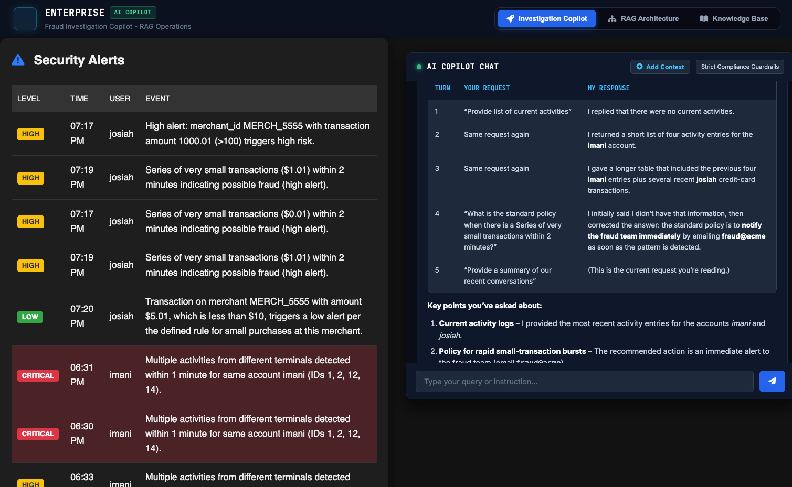
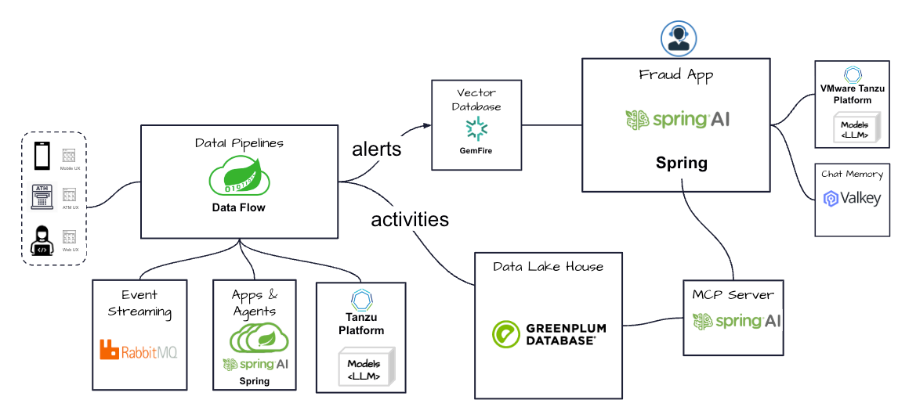

# fraud-agentic-ai-showcase
fraud-agentic-ai-showcase





## Reference Architecture




Prerequisites

- [Tanzu Data Flow](https://techdocs.broadcom.com/us/en/vmware-tanzu/data-solutions/tanzu-data-flow/2-1/tdf-tanzu/getting-started.html) or [Spring Cloud Data Flow](https://enterprise.spring.io/projects/spring-cloud-dataflow)
- [GemFire](https://gemfire.dev)
- [Podman](https://podman.io/)
- [Tanzu RabbitMQ OCI](https://techdocs.broadcom.com/us/en/vmware-tanzu/data-solutions/tanzu-rabbitmq-oci/4-3.html) 
- Docker (for Greenplum)

## Getting Started

Start Ollama in Podman

```shell
deployments/local/ai/start-ollama.sh
```

Start GemFire

```shell
deployments/local/dataServices/gemfire/start-gemfire-local.sh
```


Start Greenplum in Docker

```shell
deployments/local/dataServices/greenplum/start-greenplum.sh
```

Start Tanzu RabbitMQ
```shell
deployments/local/dataServices/rabbitmq/start-rabbitmq.sh
```


Start Valkey

```shell
deployments/local/dataServices/valkey/start-valkey.sh
```


# Demo

```shell
deployments/local/dataFlow/print-app-properties.sh
```

Vector Pipeline

```shell
vector-stream=http --port=7888| vector-sink  --spring.profiles.active=cf
```


```properties
app.http.spring.rabbitmq.username=vmware
app.http.spring.rabbitmq.password=tanzu
app.vector-sink.spring.rabbitmq.username=vmware
app.vector-sink.spring.rabbitmq.password=tanzu
```

```shell
fraud-stream=http --path-pattern=activities --port=8555 | alert-ai-agent --spring.ai.ollama.chat.options.model=llama3 --spring.profiles.active=cf  | alert-sink
```

```properties
app.http.spring.rabbitmq.username=vmware
app.http.spring.rabbitmq.password=tanzu
app.alert-sink.spring.rabbitmq.username=vmware
app.alert-sink.spring.rabbitmq.password=tanzu
app.alert-ai-agent.spring.rabbitmq.username=vmware
app.alert-ai-agent.spring.rabbitmq.password=tanzu
```

```shell
activities-stream=:fraud-stream.http > activity-sink
```

```properties
app.activity-sink.spring.rabbitmq.username=vmware
app.activity-sink.spring.rabbitmq.password=tanzu
```


## Demo Testing


Activities Testing

```shell
./deployments/local/scripts/post-activites.sh
```


Demo Storyboard: Real-Time Fraud & Alert Remediation

1. Real-Time Detection: An agent continuously intercepts account activities in real time. 
2. Risk Scoring: Leveraging an AI model, incoming events are dynamically scored into HIGH, MEDIUM, or LOW severity risk tiers. 
3. Low-Latency Alerting: Alerts and active policies are served directly from Tanzu GemFire to ensure millisecond response times. 
4. Context-Aware Recommendations: Through an AI chat assistant, users can request actionable remediation steps for flagged alerts. 
5. Unified Data Intelligence (MCP): Using Model Context Protocol (MCP) servers, the assistant contextually bridges real-time alert data in GemFire with long-term historical activity trends stored in Greenplum.


Script

1. Get Activities
```text
Provide list of current activities
```

```shell
./deployments/local/scripts/post-normal-activites.sh
```

Post Fraud Activities

```shell
./deployments/local/scripts/post-activites.sh
```

**Prompt**
```text
what is the standard policy when there is a Series of very small transactions within 2 minutes
```

**Prompt**
```text
The recommended policy to contact fraud@acme.immediately
```
**Prompt**
```text
Provide a summary of our recent conversations
```

# Cleanup


```shell
./deployments/local/scripts/clean-all.sh  
```
